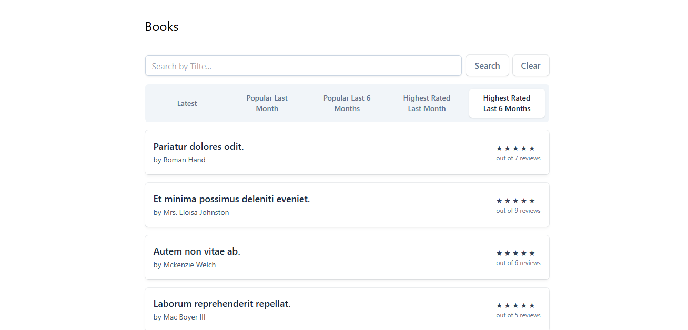
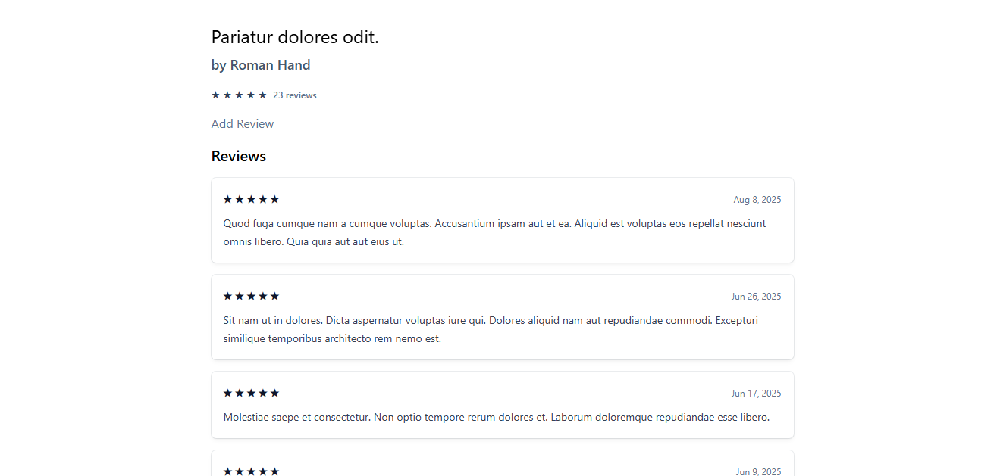

# Book Reviews

A modern Laravel project for browsing and reviewing books with advanced filtering, caching, and rate limiting — built for high performance and great user experience.

---

## Features

- Display books with multiple dynamic filters:
  - **Latest**: Shows all books sorted by the newest (date added).
  - **Popular (Last Month & Last 6 Months)**: Sorted by number of reviews in the given time frame.
  - **Highest Rated (Last Month & Last 6 Months)**: Sorted by average rating in the given time frame.
- Combined search and filter functionality for book titles with pagination support.
- Efficient caching:
  - Books data cached for 1 hour.
  - Individual book cache cleared on update or delete.
  - Reviews for each book cached and automatically cleared on review creation, update, or deletion.
- Rate limiting via Laravel's RateLimiter middleware: limits users to 3 reviews per hour to prevent spam.
- No user authentication required (open review submission).
- Built on Laravel's model binding and scoped queries for clean, expressive routing and querying.
- Uses MySQL as the database.
- Fully utilizes Laravel Eloquent relationships with eager loading (`withCount`, `withAvg`) to optimize queries.

---

## Technical Details

- **Caching:**

  - Book data cached for 60 minutes.
  - Reviews cached per book and cleared on review create/update/delete.
  
- **Database:**

  - MySQL used as the database backend.
  - Review factory includes three rating methods:
    - `good()` — ratings between 4 and 5.
    - `average()` — ratings between 2 and 4.
    - `bad()` — ratings between 1 and 2.
  - Seeder generates 100+ books with associated reviews distributed evenly among good, average, and bad ratings.

- **Frontend:**

  - Uses Tailwind CSS for styling.
  - Tailwind installed and compiled with `npm install`, `npm run dev`, and `npm run build`.

- **Laravel & Tailwind Versions:**

  - Laravel: v12.22.1 (latest stable at the time of writing).
  - Tailwind CSS: v4.1.11 (latest stable at the time of writing).

---

## Installation & Setup

1. Clone the repo and run composer install:
   bash:
   composer install

2. Install Node packages and build assets:
   bash:
   npm install
   npm run dev   # For development
   npm run build # For production

3. Configure your .env file for MySQL database connection.

4. Run migrations and seeders:
   php artisan migrate --seed 

5. Serve the application:
   php artisan serve

## Usage

- Browse the collection of books with flexible filtering options including latest releases, most popular within the last month or six         months, and highest rated during the same periods.
- Utilize the search input to find books by title or keywords, with the ability to combine search queries with applied filters.
- Navigate through paginated results for an organized and smooth browsing experience.
- View detailed information on each book, such as title, author, review count, average rating, and a list of recent reviews sorted by         newest first.
- Submit reviews for any book without the need for user registration or authentication.
- Review submissions are limited to a maximum of three per hour per user to prevent spam and ensure fair usage.

---
## Key Features & Challenges

- Implemented advanced caching strategies to reduce database load and speed up response times.
- Used Laravel's RateLimiter to effectively prevent spam by limiting review submissions.
- Ensured clean and maintainable code with scoped queries and route model binding.

---
screenshots: 

---

## License
This project is licensed under the MIT License.

---

## Made with ❤️ by Mohamed Elabyad

If you have any questions or want to get in touch, feel free to reach out:
📧 Email: m.elabyad.work@gmail.com
